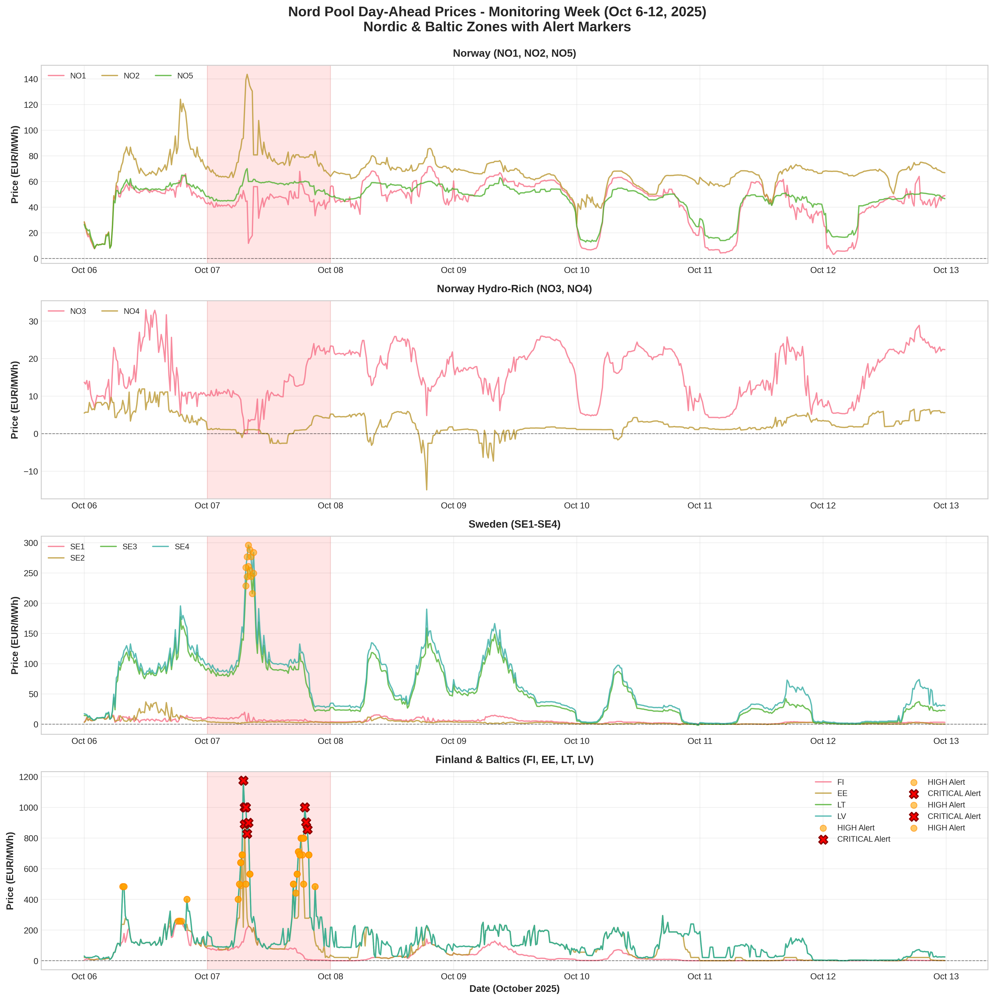

# GitHub Repository Setup Guide
## Nord Pool Market Surveillance Project

**Quick guide to getting your project on GitHub**

---

## 📋 Prerequisites

- Git installed on your computer ([Download Git](https://git-scm.com/downloads))
- GitHub account ([Sign up](https://github.com/join))
- Command line/terminal access

---

## 🚀 Step-by-Step Setup

### Step 1: Create GitHub Repository

1. Go to [GitHub.com](https://github.com/) and sign in
2. Click the **"+"** icon (top right) → **"New repository"**
3. Configure your repository:
   - **Repository name:** `nord-pool-surveillance`
   - **Description:** "Market Surveillance Alert System for Nordic & Baltic Day-Ahead Electricity Markets"
   - **Visibility:** ✅ Public (for portfolio) or 🔒 Private (if confidential)
   - **Initialize:** ❌ Do NOT initialize with README (we have our own)
4. Click **"Create repository"**

---

### Step 2: Organize Your Local Files

Create this folder structure on your computer:

```
nord-pool-surveillance/
├── src/
│   ├── market_surveillance_alerts.py
│   └── visualizations.py
├── data/
│   └── README.md
├── output/
│   ├── alerts_oct6-12.csv
│   ├── visualization_1_timeseries_alerts.png
│   ├── visualization_2_heatmap.png
│   ├── visualization_3_oct7_detail.png
│   └── visualization_4_dashboard.png
├── docs/
│   ├── INVESTIGATION_FRAMEWORK.md
│   ├── UMM_ANALYSIS.md
│   └── CASE_STUDY_SUMMARY.md
├── .gitignore
├── LICENSE
├── README.md
└── requirements.txt
```

**Where to get files:**
- All files are in `/mnt/user-data/outputs/` from our work
- Rename `README_GITHUB.md` → `README.md`
- Rename `DATA_README.md` → `data/README.md`
- Move Python scripts to `src/` folder
- Move PNG files to `output/` folder
- Move markdown docs to `docs/` folder

---

### Step 3: Initialize Git Locally

Open terminal/command prompt in your `nord-pool-surveillance` folder:

```bash
# Initialize git repository
git init

# Add all files
git add .

# Create first commit
git commit -m "Initial commit: Nord Pool Market Surveillance Alert System"
```

---

### Step 4: Connect to GitHub

Replace `[YOUR-USERNAME]` with your GitHub username:

```bash
# Add remote repository
git remote add origin https://github.com/[YOUR-USERNAME]/nord-pool-surveillance.git

# Push to GitHub
git branch -M main
git push -u origin main
```

**If you get authentication error:**
- Use GitHub Personal Access Token instead of password
- Settings → Developer settings → Personal access tokens → Generate new token
- Use token as password when prompted

---

### Step 5: Verify Upload

1. Go to `https://github.com/[YOUR-USERNAME]/nord-pool-surveillance`
2. Verify all files uploaded correctly
3. Check that README.md displays properly

---

## 🎨 Customize Your README

### Add Your Personal Info

Edit `README.md` and update these sections:

```markdown
## 📞 Contact

**Author:** Amalie Berg  
**LinkedIn:** [Your LinkedIn URL]  
**Email:** [Your Email]  
**Portfolio:** [Your Portfolio]
```

### Update Repository Links

If you used different username:
```markdown
git clone https://github.com/[YOUR-USERNAME]/nord-pool-surveillance.git
```

---

## 📸 Add Images to README

GitHub will automatically render your PNG images. The README already includes:

```markdown

```

These will display beautifully on your repository page!

---

## 🏷️ Add Topics/Tags

On your GitHub repository page:
1. Click **"⚙️ Settings"** (top right of repo)
2. Go to **"About"** (right sidebar)
3. Click **"⚙️"** next to "About"
4. Add topics:
   - `python`
   - `data-science`
   - `market-surveillance`
   - `electricity-markets`
   - `nord-pool`
   - `remit`
   - `anomaly-detection`
   - `energy-trading`
   - `visualization`
5. Save changes

---

## 📝 Optional: Add GitHub Pages

To create a website from your README:

1. Go to **Settings** → **Pages**
2. Source: **Deploy from a branch**
3. Branch: **main** → **/ (root)**
4. Save
5. Your site will be at: `https://[YOUR-USERNAME].github.io/nord-pool-surveillance/`

---

## 🔒 Important: Data Privacy

**Before pushing to GitHub, ensure:**

✅ `.gitignore` is set up (we provided this)  
✅ No actual Nord Pool price data in `data/` folder  
✅ No confidential information in files  
✅ No API keys or credentials in code  

**Double-check `.gitignore` includes:**
```
data/*.xlsx
data/*.csv
```

---

## 🌟 Make Your Repo Stand Out

### 1. Add Repository Description
On main repo page → "About" → Add description:
> "Python-based market surveillance system for detecting price anomalies in Nordic & Baltic electricity markets. Detected critical October 7, 2025 event (1,173 EUR/MWh) caused by Storm Amy. Developed for Nord Pool Market Surveillance Analyst case study."

### 2. Add a Screenshot
Add a hero image at the top of README:
```markdown

```

### 3. Add Badges
We already included:
- Python version badge
- License badge  
- Status badge

### 4. Star Your Own Repo
Click the ⭐ star button to show it's a featured project!

---

## 🔄 Future Updates

To update your repository after initial push:

```bash
# Make changes to files

# Stage changes
git add .

# Commit changes
git commit -m "Description of changes"

# Push to GitHub
git push origin main
```

---

## 💼 For Your Resume/Portfolio

### Link Format
Add to your resume:
```
Market Surveillance Alert System
[GitHub](https://github.com/[YOUR-USERNAME]/nord-pool-surveillance) | Python, Data Analysis, Market Surveillance

Developed comprehensive anomaly detection system for Nordic electricity markets,
successfully identifying critical price event during Storm Amy (Oct 7, 2025).
Implemented 5 alert algorithms, generated 1,244 alerts, and created investigation
framework following REMIT regulations.
```

### Portfolio Description
```
This project demonstrates my capabilities in:
- Python programming (pandas, numpy, matplotlib)
- Statistical analysis and anomaly detection
- Data visualization and communication
- Market surveillance and regulatory compliance (REMIT)
- Root cause analysis and investigation methodology
- Energy market dynamics and weather impact assessment

Developed for Nord Pool (Euronext Group) Market Surveillance Analyst position.
```

---

## ✅ Checklist

Before you consider the repository "complete":

- [ ] All files uploaded successfully
- [ ] README.md displays correctly with images
- [ ] .gitignore working (no confidential data uploaded)
- [ ] LICENSE file included
- [ ] Contact information updated in README
- [ ] Repository description added
- [ ] Topics/tags added
- [ ] Repository is public (or private if preferred)
- [ ] Tested clone command works
- [ ] All links in README functional
- [ ] Visualizations display properly
- [ ] Requirements.txt included

---

## 🆘 Troubleshooting

### Problem: "Permission denied (publickey)"
**Solution:** Use HTTPS instead of SSH:
```bash
git remote set-url origin https://github.com/[YOUR-USERNAME]/nord-pool-surveillance.git
```

### Problem: Large files won't upload
**Solution:** GitHub has 100MB file limit
- Check if any PNG files >100MB
- Reduce image size if needed
- Consider Git LFS for large files

### Problem: Images not displaying
**Solution:** Check file paths
- Paths are case-sensitive
- Use forward slashes: `output/image.png`
- Relative paths from README location

### Problem: Merge conflicts
**Solution:** If you edited on GitHub and locally:
```bash
git pull origin main
# Resolve conflicts in files
git add .
git commit -m "Resolved conflicts"
git push origin main
```

---

## 📚 Additional Resources

- [GitHub Docs](https://docs.github.com/)
- [Git Tutorial](https://git-scm.com/book/en/v2)
- [Markdown Guide](https://www.markdownguide.org/)
- [GitHub Pages](https://pages.github.com/)

---

## 🎉 You're Done!

Your professional portfolio piece is now live on GitHub!

**Share your repository:**
- On LinkedIn: "Proud to share my latest project..."
- In job applications: Include GitHub link
- With recruiters: Direct link to demonstrate skills
- With Nord Pool: Show your work!

---

**Good luck with your Nord Pool interview! 🚀**
