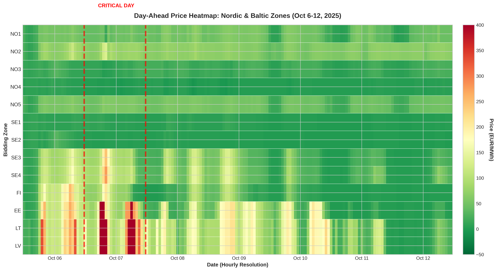
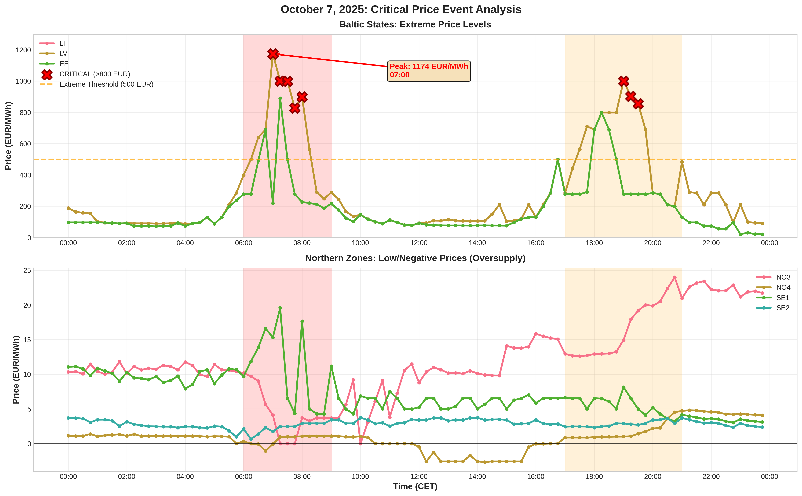
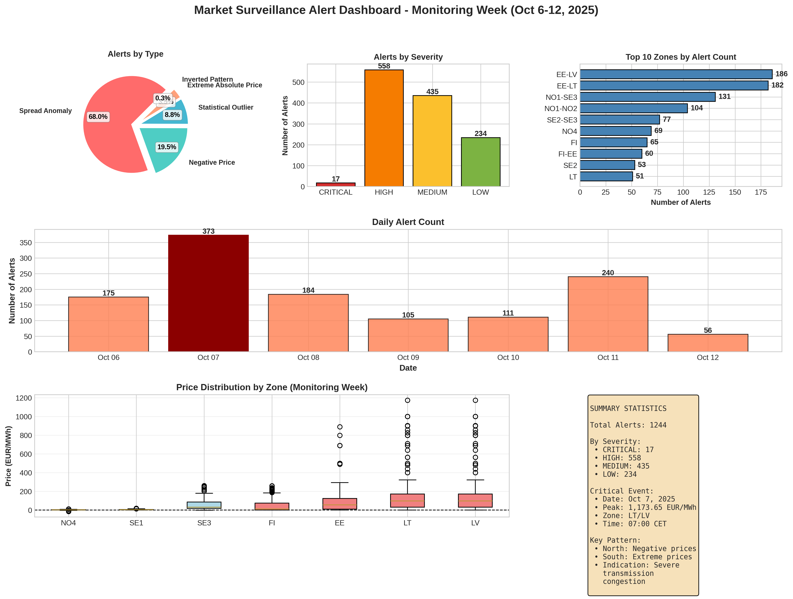

# Nord Pool Market Surveillance Alert System
**Day-Ahead Price Anomaly Detection for Nordic & Baltic Markets**

[](https://www.python.org/downloads/)
[](LICENSE)
[]()

---

## Project Overview

This project implements a comprehensive **market surveillance alert system** for detecting suspicious price behavior in Nordic and Baltic day-ahead electricity markets. Developed as part of a case study for a **Market Surveillance Analyst** position at **Nord Pool** (Euronext Group).

The system successfully identified a critical price event on **October 7, 2025**, when Lithuania and Latvia experienced prices of **1,173.65 EUR/MWh** - later determined to be caused by **Storm Amy** combined with transmission system stress.

---

## Key Features

### Alert Detection System
- **5 complementary detection algorithms** combining statistical and rule-based approaches
- **1,244 alerts generated** during monitoring week (October 6-12, 2025)
- **Severity classification**: CRITICAL / HIGH / MEDIUM / LOW
- **Multi-zone analysis**: 13 Nordic & Baltic bidding zones

### Visualization Suite
- **4 professional visualizations** (publication-quality, 300 DPI)
- Time series with alert markers
- Geographic heatmap
- Detailed critical event analysis
- Comprehensive dashboard

### Investigation Framework
- **5-phase investigation methodology**
- **Weather event correlation** (Storm Amy)
- **UMM publication cross-reference**
- **Transmission capacity analysis**

---

## Key Findings

### Critical Event: October 7, 2025

**Price Anomaly:**
- **Peak**: 1,173.65 EUR/MWh (Lithuania/Latvia, 07:00 CET)
- **North-South Divergence**: >1,000 EUR spread between NO4 and LT
- **373 alerts** on single day (30% of weekly total)

**Root Cause Analysis:**
- **Storm Amy** created high wind generation in north (→ negative prices)
- **Transmission constraints** prevented north-to-south power flow
- **Baltic demand spike** + limited import capacity (→ extreme prices)
- **Market coupling delays** (1-hour publication delay, system under stress)

**Evidence:**
- Cross-referenced with Nord Pool UMM publications
- September 2025 showed pre-existing system stress (manual fallback Sept 25)
- Legitimate physical scarcity, not market manipulation

---

## Technology Stack

**Core:**
- Python 3.8+
- pandas, numpy (data processing)
- matplotlib, seaborn (visualization)
- scipy (statistical analysis)

**Data:**
- Nord Pool day-ahead auction prices (2025)
- 8,567 hourly observations across 23 European zones
- Focus: 13 Nordic & Baltic zones

---

## Repository Structure

```
nord-pool-surveillance/
│
├── src/
│   ├── market_surveillance_alerts.py    # Main alert detection system
│   └── visualizations.py                 # Visualization generation
│
├── data/
│   └── README.md                         # Data source information
│
├── output/
│   ├── alerts_oct6-12.csv               # Generated alerts (1,244 records)
│   ├── visualization_1_timeseries.png   # Time series with alerts
│   ├── visualization_2_heatmap.png      # Price heatmap
│   ├── visualization_3_oct7_detail.png  # Oct 7 critical event
│   └── visualization_4_dashboard.png    # Alert dashboard
│
├── docs/
│   ├── INVESTIGATION_FRAMEWORK.md       # 5-phase investigation methodology
│   ├── UMM_ANALYSIS.md                  # UMM publication analysis
│   └── CASE_STUDY_SUMMARY.md            # Complete case study writeup
│
├── requirements.txt                      # Python dependencies
├── LICENSE                               # MIT License
└── README.md                             # This file
```

---

## Quick Start

### Installation

```bash
# Clone repository
git clone https://github.com/[your-username]/nord-pool-surveillance.git
cd nord-pool-surveillance

# Install dependencies
pip install -r requirements.txt
```

### Usage

```bash
# Run alert detection system
python src/market_surveillance_alerts.py

# Generate visualizations
python src/visualizations.py
```

**Note:** Due to data confidentiality, the actual Nord Pool price data file is not included in this repository. The scripts are configured to work with the standard Nord Pool data format.

---

## Alert Types Implemented

### 1. Statistical Outliers (Z-Score Method)
- Detects prices deviating >3σ from baseline
- **Result:** 109 alerts

### 2. Negative Prices
- Flags oversupply situations (price < 0)
- **Result:** 242 alerts

### 3. Extreme Absolute Prices
- Identifies severe scarcity (>500 EUR/MWh)
- **Result:** 43 alerts (17 CRITICAL)

### 4. Cross-Border Spread Anomalies
- Detects unusual spreads between interconnected zones
- **Result:** 846 alerts (68% of total - indicates congestion)

### 5. Inverted Hourly Patterns
- Flags days where peak hours cheaper than off-peak
- **Result:** 4 alerts

---

## Visualizations

### Time Series with Alert Markers


### Price Heatmap (Geographic + Temporal)


### October 7 Critical Event Detail


### Alert Dashboard


---

## Investigation Methodology

### Phase 1: Data Verification
- Confirm price accuracy
- Check REMIT transparency platform for UMM publications

### Phase 2: Fundamental Analysis
- Weather conditions (Storm Amy identified)
- Generation/transmission outages
- Demand patterns

### Phase 3: Market Behavior Analysis
- Order book concentration
- Participant bidding patterns
- Cross-market analysis (day-ahead vs. intraday)

### Phase 4: Regulatory Assessment
- Evidence of manipulation?
- Inside information disclosure compliance
- REMIT Articles 3, 4, 5 compliance

### Phase 5: Documentation & Escalation
- Comprehensive case file
- Recommendation for NRA notification if needed

---

## Key Learnings

### Technical
- **Multi-method detection** more robust than single approach
- **Baseline selection critical** (9-month baseline: Jan-Oct 5, 2025)
- **Severity classification** enables effective alert triage

### Market Surveillance
- **Context matters**: High prices ≠ manipulation
- **Weather events** increasingly important (climate change)
- **System performance** under stress requires monitoring
- **UMM publications** essential for investigation

### Recommendations for Nord Pool
1. **Enhance coupling algorithm** for extreme weather scenarios
2. **Review TSO capacity reduction protocols** during storms
3. **Improve system monitoring** to prevent manual fallbacks
4. **Develop early warning system** for transmission stress 

---

## Skills Demonstrated

**Technical:**
- Python programming (pandas, numpy, matplotlib)
- Statistical analysis (Z-scores, outlier detection)
- Data visualization (publication-quality charts)
- Algorithm design (multi-method detection)

**Domain Expertise:**
- Nordic/Baltic electricity market structure
- REMIT regulation (market abuse prevention)
- Transmission congestion analysis
- Weather impact on power markets

**Analytical:**
- Root cause analysis
- Pattern recognition
- Evidence-based investigation
- Regulatory compliance assessment

---

## Disclaimer

This is a case study project developed for a Market Surveillance Analyst interview. While based on realistic market scenarios and professional surveillance methodologies, specific market data and findings are used for educational and demonstration purposes. All analysis follows public REMIT guidelines and market surveillance best practices.

---

